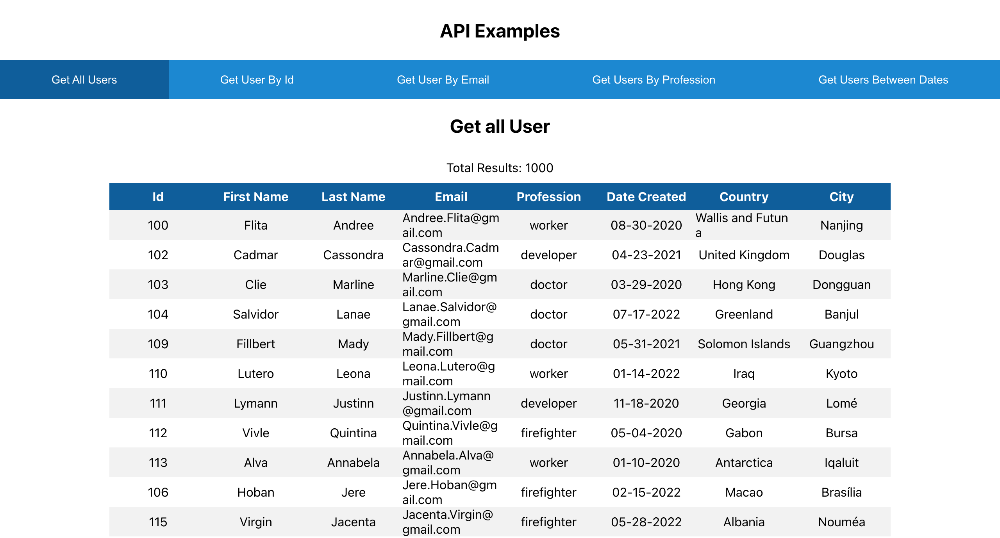

# Mag Mutual Project

## Table of Contents
- [Description](#description)  
- [Installation](#installation)
- [Usage](#usage)
- [Links](#links)  
- [Visuals](#visuals)
- [Questions](#questions)

***

## Description
This is a full-stack application that creates an api using mock
seed data and displays it in table form. By clicking the links
the user can trigger different api calls hosted by the 
server. The Technology used are: React, Node, Express, PGSQL.

***

## Installation
To install, run this command: `npm i`

`npm run create-db` to create the db locally.

`npm run seed-db` to add seed data to the db.

To run both the server and the client `npm run dev`

To run the server exclusively `npm run server`

To run the client exclusively `npm run client`

***

## Usage

This DB is not hosted. In order to run this locally, PostgresSQL must be

installed on your computer.

***

## Links
[Project Link to GitHub](https://github.com/simone188535/Mag-Mutual-TH)  
 

***

## Visuals

***

## Questions
If you have any questions at all, please email us at: 

simone.anthony1@yahoo.com

